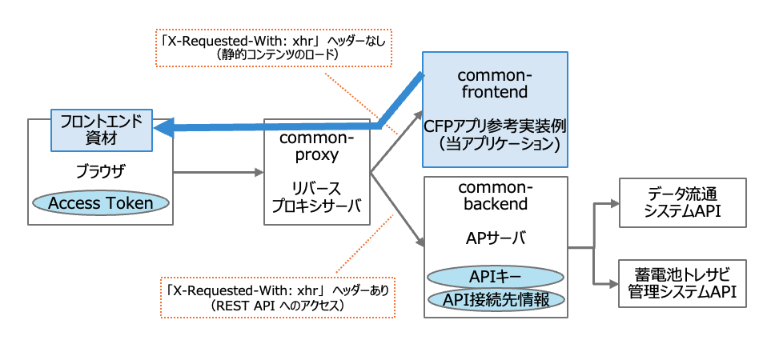
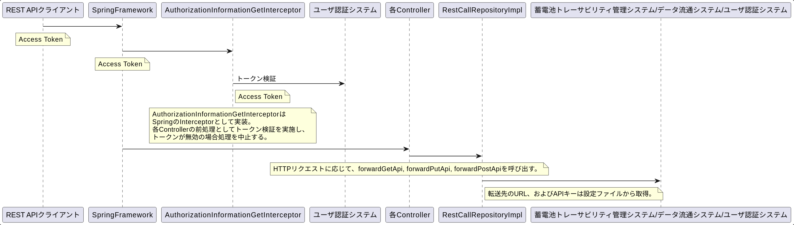

<!-- @import "[TOC]" {cmd="toc" depthFrom=1 depthTo=6 orderedList=false} -->

<!-- code_chunk_output -->

- [概要](#概要)
  - [アプリケーション構成](#アプリケーション構成)
- [前提とする環境](#前提とする環境)
  - [アプリケーション実行環境](#アプリケーション実行環境)
- [ビルド・起動手順](#ビルド起動手順)
  - [リポジトリのクローン](#リポジトリのクローン)
  - [ローカル環境でのビルド・起動](#ローカル環境でのビルド起動)
    - [ソフトウェアのインストール](#ソフトウェアのインストール)
      - [Java](#java)
      - [Maven](#maven)
      - [Tomcat](#tomcat)
    - [アプリケーションのビルド](#アプリケーションのビルド)
    - [アプリケーションのデプロイと起動](#アプリケーションのデプロイと起動)
      - [warファイルのデプロイ](#warファイルのデプロイ)
      - [Tomcatの起動](#tomcatの起動)
      - [ログファイル確認](#ログファイル確認)
    - [アプリケーションの停止](#アプリケーションの停止)
- [テスト手順](#テスト手順)
  - [結合テストの実行](#結合テストの実行)
- [設計標準](#設計標準)
- [コーディング規約](#コーディング規約)
- [処理概要](#処理概要)
  - [リクエストバックエンド転送機能](#リクエストバックエンド転送機能)
- [問合せ及び要望に関して](#問合せ及び要望に関して)
- [ライセンス](#ライセンス)
- [免責事項](#免責事項)

<!-- /code_chunk_output -->


## 概要

当アプリケーションは、蓄電池トレーサビリティ管理システムの CFP アプリ参考実装例である。

### アプリケーション構成

当アプリケーションは、Web UI (sample-application-cfp-frontend, 以下 cfp-frontend)、リバースプロキシサーバ (sample-application-cfp-proxy, 以下 cfp-proxy) およびAPサーバ (sample-application-cfp-backend, 以下 cfp-backend) の併用が前提となる。
本リポジトリでは cfp-backend を説明対象とし、cfp-frontend と cfp-proxy は別のリポジトリで提供する。



- CFPアプリ参考実装例 (cfp-frontend)
  - 蓄電池トレーサビリティ管理システムの CFP アプリ参考実装例である。
  - データ流通システム API および蓄電池トレーサビリティ管理システム API を利用してデータの参照や登録を行う。
  - ブラウザは、当アプリケーションからフロントエンド資材をロードする。
  - 当アプリケーションからこれらの API へアクセスを行う際には、`X-Requested-With: xhr` ヘッダーが付与される。
  - リバースプロキシサーバ (cfp-proxy) により `X-Requested-With: xhr` ヘッダーの有無で転送先を振り分ける。
  - API のエンドポイントと API キーの情報は、cfp-backend アプリケーションが保持するため、当アプリケーション内での設定は行わない。

- リバースプロキシサーバ (cfp-proxy)
  - ブラウザからのアクセス先となるリバースプロキシサーバである。
  - cfp-frontend アプリケーションにて API アクセス時に付与される `X-Requested-With: xhr` ヘッダーの有無に応じて、振り分け転送を行う。
    - `X-Requested-With: xhr` ヘッダーが付与されていない場合: CFP アプリ参考実装例 (cfp-frontend) へ転送する。
    - `X-Requested-With: xhr` ヘッダーが付与されている場合: AP サーバ (cfp-backend) へ転送する。

- APサーバ (cfp-backend): 当アプリケーション
  - データ流通システム API と蓄電池トレーサビリティ管理システム API へのアクセスを制御する AP サーバである。
  - API のエンドポイントと API キーの情報を保持する。
  - ブラウザからの API リクエストを処理する。

## 前提とする環境

### アプリケーション実行環境

| ツール | バージョン |
| ------ | -------------- |
| OS     | redhat ubi 8.7 |
| java   | 17.0           |
| tomcat | 10.1           |

## ビルド・起動手順

### 前提

+ ビルドマシンのOSはWindows。
+ git clientがインストールされていること。
+ git bashなど、POSIX準拠のシェルで作業を実施すること。
+ curlがインストールされていること。

### リポジトリのクローン

当リポジトリのクローンを行う。

```sh
# 当リポジトリのクローン
mkdir -p ~/workspaces
cd ~/workspaces
git clone https://github.com/ouranos-ecosystem-idi/sample-application-cfp-backend.git cfp-backend
```

### ローカル環境でのビルド・起動

#### ソフトウェアのインストール

##### Java

下記リンク先からJavaをダウンロードし、展開する。

https://download.java.net/java/GA/jdk17.0.2/dfd4a8d0985749f896bed50d7138ee7f/8/GPL/openjdk-17.0.2_windows-x64_bin.zip

```sh
# ダウンロード
mkdir -p ~/software
cd ~/software
curl -O https://download.java.net/java/GA/jdk17.0.2/dfd4a8d0985749f896bed50d7138ee7f/8/GPL/openjdk-17.0.2_windows-x64_bin.zip

# 展開
unzip openjdk-17.0.2_windows-x64_bin.zip

# 環境変数を設定
export JAVA_HOME=~/software/jdk-17.0.2
```

##### Maven

下記リンク先からMavenをダウンロードし、展開する。

https://dlcdn.apache.org/maven/maven-3/3.9.6/binaries/apache-maven-3.9.6-bin.zip

```sh
mkdir -p ~/software
cd ~/software
curl -O https://dlcdn.apache.org/maven/maven-3/3.9.6/binaries/apache-maven-3.9.6-bin.zip

# 展開
unzip apache-maven-3.9.6-bin.zip

# PATH追加
export PATH="~/software/apache-maven-3.9.6/bin:$PATH"
```

##### Tomcat

下記リンク先からTomcatをダウンロードし、展開する。

https://archive.apache.org/dist/tomcat/tomcat-10/v10.1.7/bin/apache-tomcat-10.1.7.tar.gz

```sh
curl -O https://archive.apache.org/dist/tomcat/tomcat-10/v10.1.7/bin/apache-tomcat-10.1.7.tar.gz
mkdir -p ~/software
tar -xzvf apache-tomcat-10.1.7.tar.gz -C ~/software
```

#### アプリケーションのビルド

```sh
# pom.xmlファイルが存在するフォルダに移動
cd ~/workspaces/cfp-backend

# パッケージのインストール
mvn clean package

# common-backend.warファイルが作成されていることを確認
ls target
```

#### アプリケーションのデプロイと起動

##### warファイルのデプロイ

```sh
cp ~/workspaces/cfp-backend/target/common-backend.war ~/software/apache-tomcat-10.1.7/webapps/
```

##### Tomcatの起動

```sh
cd ~/software/apache-tomcat-10.1.7/bin
export JRE_HOME=~/software/jdk-17.0.2

./startup.sh

# http://localhost:8080でAPサーバが起動する。アプリケーションのコンテキストルートはcommon-backend。
# health APIで{"gitHash":null}レスポンスがあれば、正常起動。
curl http://localhost:8080/common-backend/health
```

##### ログファイル確認

```sh
tail -f ~/software/apache-tomcat-10.1.7/logs/catalina.out
```

#### アプリケーションの停止

```sh
cd ~/software/apache-tomcat-10.1.7/bin
./shutdown.sh
```

## テスト手順

### 結合テストの実行

Wiremockを起動し、API単位でcurlを実行する。

```sh
cd ~/workspaces/cfp-backend/src/test/wiremock
java -jar wiremock-standalone-3.3.1.jar --port 8081 --verbose --print-all-network-traffic
```

別のターミナルを起動し、REST APIへのリクエストを実行する。
下記は、datatransport APIに対して、curlでGETを実行する例である。

```sh
# api/v1/datatransport APIに対するGETで稼働確認。
curl 'http://localhost:8080/common-backend/api/v1/datatransport?dataTarget=parts&parentFlag=true&limit=100'
```

## 連携システムとの接続情報
データ流通システムや蓄電池トレーサビリティ管理システムといった連携システムとの接続に関する情報は、
src/main/resources/META-INF/spring/common-backend-infra.properties に設定する。
変更した内容を反映するには、アプリケーションの再ビルドとデプロイが必要である。
本ファイル中の各プロパティの意味を以下に示す。

| プロパティ | 説明 |
| ---------- | ---- |
| URL_DATA_TRANSPORT_SYSTEM      | データ流通システム API のベース URL (パスを除いた部分) を指定する。 |
| URL_TRACEABILITY_SYSTEM        | 蓄電池トレーサビリティ管理システム API のベース URL (パスを除いた部分) を指定する。 |
| URL_INTROSPECTION_ENDPOINT     | 認証トークンのイントロスペクションに使用するエンドポイントの URL を指定する。 |
| API_KEY_DATA_TRANSPORT_SYSTEM  | データ流通システム API へのリクエストヘッダに付与する API キーを指定する。 |
| API_KEY_TRACEABILITY_SYSTEM    | 蓄電池トレーサビリティ管理システム API へのリクエストヘッダに付与する API キーを指定する。 |
| API_KEY_INTROSPECTION_ENDPOINT | 認証トークンのイントロスペクションに使用するエンドポイントへのリクエストヘッダに付与する API キーを指定する。 |
| AWS_KMS_KEY_ID                 | 蓄電池トレーサビリティ管理システム API のファイルアップロード用URL取得 API へのリクエストヘッダに付与する AWS KMS キーを指定する。 |

## 設計標準
本Javaアプリケーションは TERASOLUNA Server Framework for Java (5.x) を設計標準としており、今後の機能拡張をする場合もこれに準拠する。
詳細は下記リンクを参照。
http://terasolunaorg.github.io/guideline/current/ja/

## コーディング規約

[SonarQube の 2024年時点の LTS 版 v9.9.2](https://www.sonarsource.com/products/sonarqube/downloads/lts/9-9-lts/) の Sonar way ルールを適用している。

## 処理概要
処理の全体像を把握するための概要を説明する。概要把握が目的であるため、シーケンス図は主要なクラスのみを記載している。

### リクエストバックエンド転送機能



## 問合せ及び要望に関して
- 本リポジトリは現状は主に配布目的の運用となるため、IssueやPull Requestに関しては受け付けておりません。

## ライセンス
- 本リポジトリはMITライセンスで提供されています。
- ソースコードおよび関連ドキュメントの著作権は株式会社NTTデータグループに帰属します。

## 免責事項
- 本リポジトリの内容は予告なく変更・削除する可能性があります。
- 本リポジトリの利用により生じた損失及び損害等について、いかなる責任も負わないものとします。
